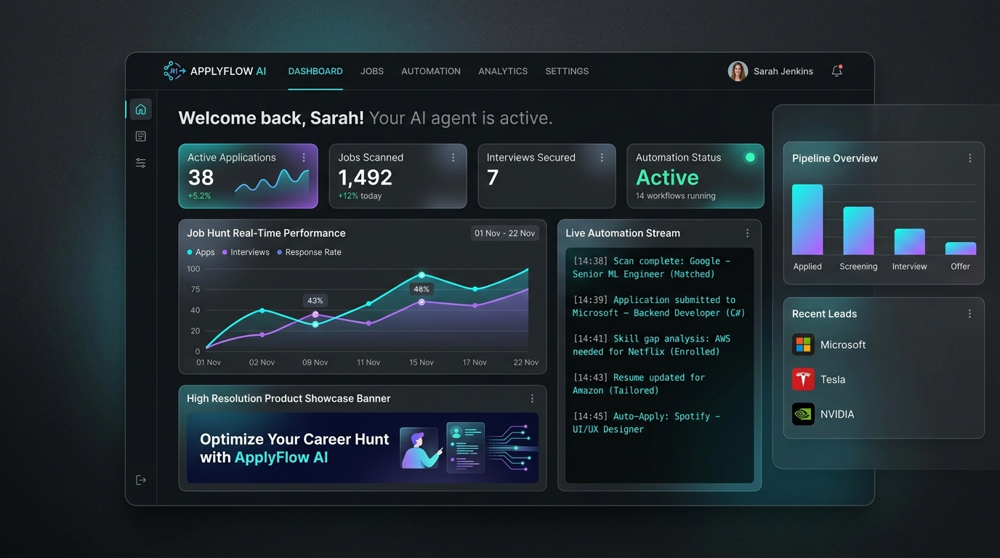
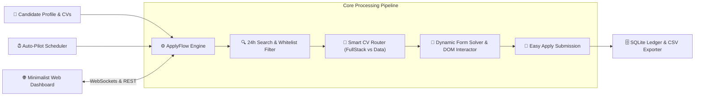

<p align="center">
  
</p>

<h1 align="center">⚡ ApplyFlow AI</h1>

<p align="center">
  <strong>The Autonomous, High-Precision Job Application Engine & Real-Time Orchestrator.</strong><br>
  <em>Never manually fill another repetitive job application form again. Designed for Software Engineers & Data Professionals.</em>
</p>

<p align="center">
  <a href="https://github.com"></a>
  <a href="https://python.org"></a>
  <a href="https://playwright.dev"></a>
  <a href="https://fastapi.tiangolo.com"></a>
  <a href="#"></a>
</p>

---

## 🌟 Why ApplyFlow AI?

Job hunting in tech has become an exhaustive numbers game of repetitive forms, mismatched keywords, and clunky ATS portals. **ApplyFlow AI** solves this by acting as your autonomous executive assistant:

- 🧠 **Context-Aware Form Solver:** Automatically answers screening questions (years of Java/React/SQL experience, work authorization, English fluency, salary expectations) with zero hallucinations.
- 🎯 **Dual-Resume Smart Router:** Intelligently analyzes the job description and attaches your **Full Stack CV** or **Data Analyst CV** depending on the vacancy match.
- 🛡️ **Anti-Junk Whitelist / Blacklist Engine:** Instantly rejects non-tech sponsored clutter (sales, waitstaff, cashier, customer service) and zeroes in exclusively on genuine software and data roles.
- 💻 **Futuristic Minimalist Real-Time Dashboard:** Watch your autonomous bot scan, evaluate, and submit applications in real-time through WebSockets.
- ⏰ **Background Auto-Pilot Scheduler:** Set autonomous cron cycles (e.g., every 6h, 12h, 24h) to apply to fresh vacancies within minutes of posting.
- 📊 **SQLite Application Ledger & CSV Export:** Track every single submission with timestamps, company names, direct links, and status.

---

## 🏗️ Architecture Overview



---

## ⚡ Quick Start (Under 3 Minutes)

### 1. Clone & Install Dependencies
```bash
# Clone the repository
git clone https://github.com/<your-username>/applyflow-ai.git
cd applyflow-ai

# Set up virtual environment
python3 -m venv .venv
source .venv/bin/activate

# Install requirements & browser engine
pip install -r requirements.txt
python -m playwright install chromium
```

### 2. Add Your Resumes
Place your PDF resumes in the [`resumes/`](resumes/) directory:
* `resumes/CV_Paulo_Espinoza_FullStack.pdf` (For Web / Java / React / Backend roles)
* `resumes/CV_Paulo_Espinoza_DataAnalyst.pdf` (For SQL / Power BI / Data roles)

### 3. Launch the Web Dashboard
```bash
python run.py web
```
Open **[http://127.0.0.1:8000](http://127.0.0.1:8000)** in your browser to access the full UI!

---

## 🖥️ Command Line Interface (CLI)

Prefer working from the terminal? ApplyFlow AI comes with a built-in CLI:

```bash
# 1. Authenticate with LinkedIn (Opens browser once to store secure session)
python run.py login

# 2. Execute an autonomous application cycle
python run.py apply

# 3. View live statistics and export CSV ledger
python run.py stats

# 4. Launch the Minimalist Web UI
python run.py web
```

---

## ⚙️ Configuration (`config.yaml`)

Customize your personal parameters, recruiter screening answers, and search queries in `config.yaml`:

```yaml
personal_info:
  first_name: "Paulo Daniel"
  last_name: "Espinoza Gamboa"
  email: "pauloespinoza951@gmail.com"
  phone_number: "906920958"
  city: "Lima"
  country: "Peru"

form_answers:
  experience_years:
    java: 1
    react: 1
    sql: 1
    default: 1
  text_mappings:
    english: "Professional working proficiency"
    salary_expectation: "1200"

job_searches:
  - query: "Practicante Java"
    location: "Lima, Perú"
    type: "fullstack"
  - query: "Junior Full Stack Developer"
    location: "Remote"
    type: "fullstack"
  - query: "Junior Data Analyst"
    location: "Remote"
    type: "data"
```

---

## 🛡️ Anti-Detection & Safety Philosophy

ApplyFlow AI implements strict anti-abuse safeguards:
1. **Persistent Session Context:** Never exposes your plaintext credentials over the network.
2. **Human-like Jitter Delays:** Random 2.0s–5.0s pauses between form interactions.
3. **Daily Quota Caps:** Default cap of 25 applications per session prevents account flags.
4. **Local Data Sovereignty:** All cookies and application databases remain strictly on your local machine.

---

## 🗺️ Roadmap

- [x] LinkedIn Easy Apply Full DOM Automation
- [x] Real-time WebSockets Live Terminal UI
- [x] Dual-CV Dynamic Routing & Auto-attachment
- [x] Whitelist & Anti-Junk Blacklist Screening
- [x] Background Auto-Pilot Scheduler (APScheduler)
- [ ] Greenhouse & Lever Direct Portal Auto-filler
- [ ] AI-Powered Custom Cover Letter Generator (Gemini Flash / OpenAI)
- [ ] WhatsApp / Telegram Instant Notification Webhook on Interview Invitation

---

## 🤝 Contributing

Contributions are warmly welcomed! Please see our [CONTRIBUTING.md](CONTRIBUTING.md) for details on submitting Pull Requests.

---

## 📄 License

Distributed under the **MIT License**. See [`LICENSE`](LICENSE) for more information.

<p align="center">
  Made with ⚡ by <a href="https://github.com">ApplyFlow AI Community</a> • Star ⭐ this repository if it helps your career hunt!
</p>
